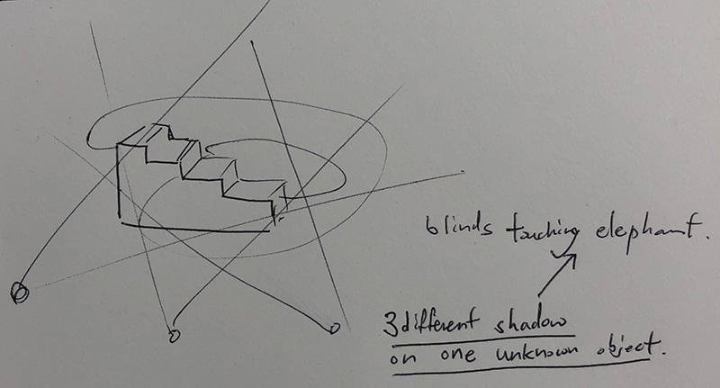
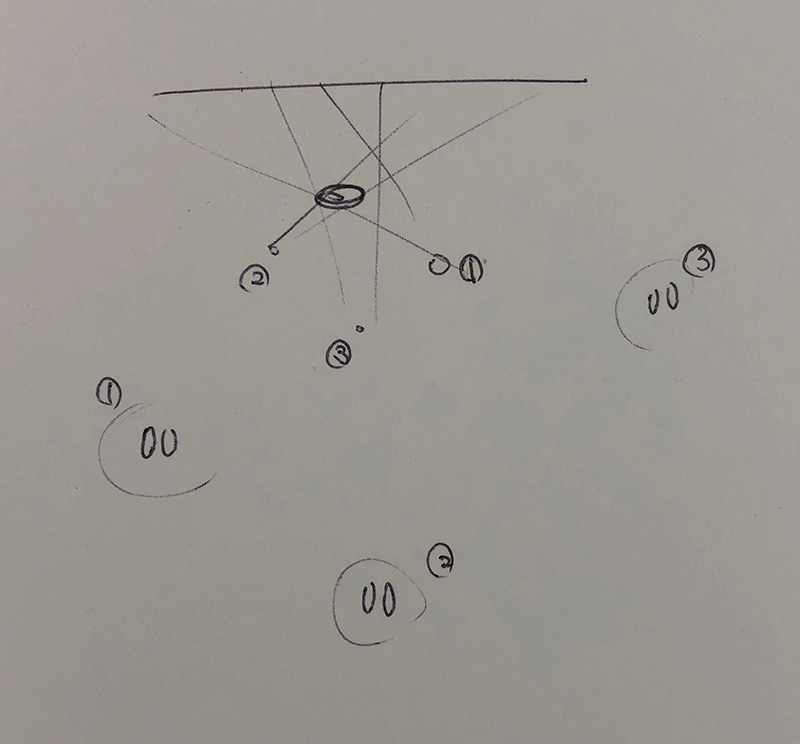
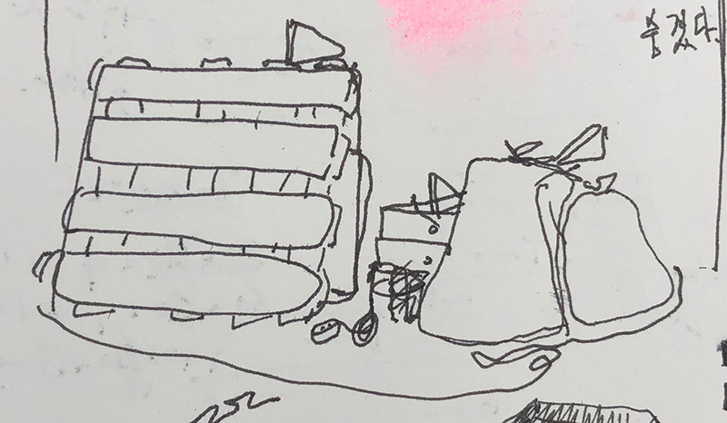

## Prototype for 3 blind(install work)

There is a story about blind men and an elephant.

It is about limited information of something could be all true and be all false simultaneously.

(https://en.wikipedia.org/wiki/Blind_men_and_an_elephant)

I made this prototype for simulating this story.

Giving limited information of an object with sound and shadow using LED and distance sensors,

When someone walk around the installed object, distance sensors detect where he or she is and turn on matched LED.

The install will be placed in random place like a rubbish heap.

